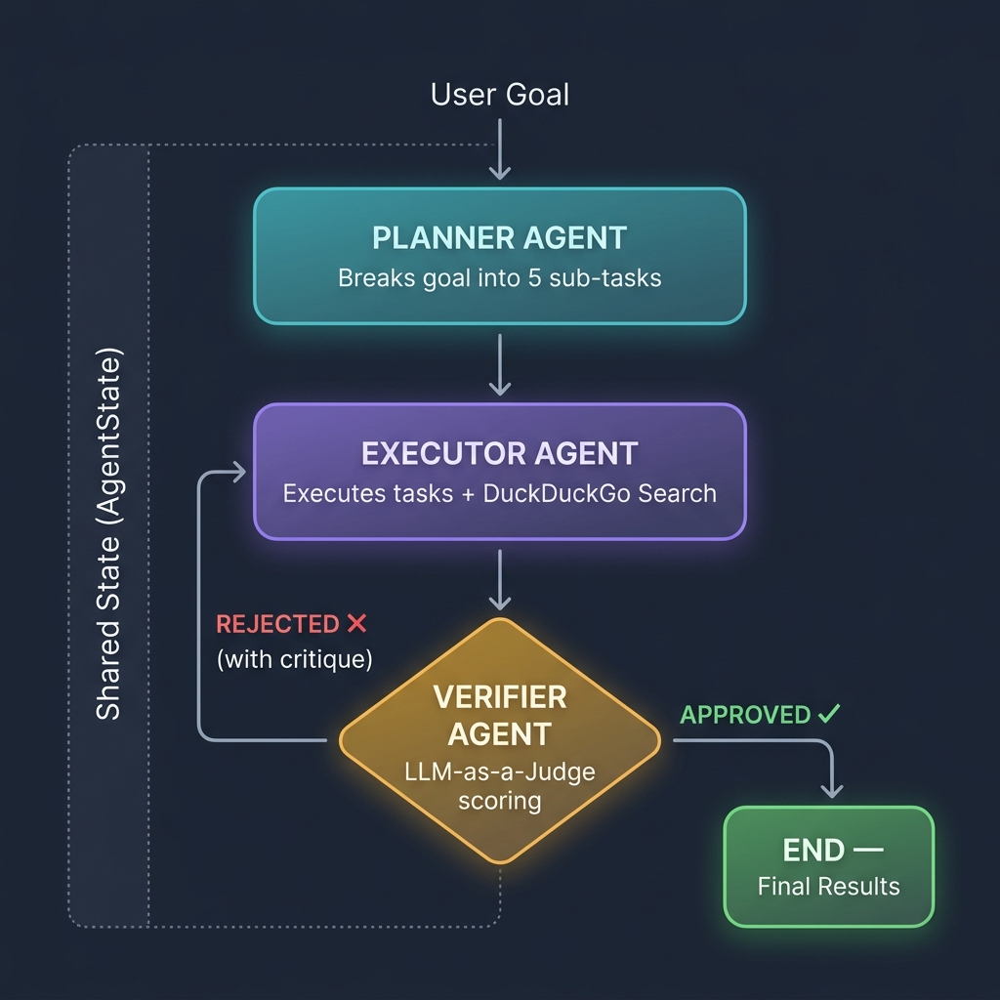

# Planner Multi-Agent System — Project Report

## Introduction

This project implements a multi-agent AI system where three specialized agents — Planner, Executor, and Verifier — work together in a loop to break down a goal, research it using live web data, and verify the quality of the output. The whole thing runs automatically through GitHub Actions.

## Objective

The goal is to build a system that takes a high-level task (like *"Research the top 3 trends in agriculture for 2025"*), splits it into smaller sub-tasks, completes each one with real-time information, and keeps refining until the results are good enough — all without any human input.

## Technologies Used

LangGraph (agent orchestration), LangChain Core (prompt and message handling), Groq API with Llama-3.1-8B-Instant (fast LLM inference), DuckDuckGo Search + ddgs (live web search), Python 3.12, and GitHub Actions for CI/CD deployment.

## Workflow Diagram

## How the Agents Work

**Planner:** Takes the user's goal and breaks it into up to 5 actionable tasks. It forces the LLM to respond in strict JSON format. If parsing fails, it falls back to treating the whole response as a single task.

**Executor:** Goes through each task one by one, runs a DuckDuckGo search for context, and uses the LLM to generate a detailed response. If a previous attempt was rejected by the Verifier, the critique is passed in so the Executor can improve its answers.

**Verifier (LLM-as-a-Judge):** Scores the combined results on Completeness (0–0.4), Accuracy (0–0.3), and Clarity (0–0.3). If the score is high enough, it approves. Otherwise, it sends a critique back to the Executor. After 3 iterations, it force-approves to prevent infinite loops.

## LangGraph Workflow and Communication

The agents are wired as nodes in a LangGraph StateGraph: Planner → Executor → Verifier. A shared state dictionary (containing the goal, tasks, results, critique, approval status, and iteration count) is passed between them. After verification, a conditional edge either loops back to the Executor or ends the graph. The agents don't talk to each other directly — they communicate only through this shared state.

## Role of DuckDuckGo Search and Groq

DuckDuckGo gives the Executor access to current web data so the answers aren't limited to the LLM's training cutoff. Groq's Llama-3.1-8B-Instant was chosen because it's fast — important when you're making multiple LLM calls per iteration across three agents.

## GitHub Actions Deployment

A workflow file (`run-agent.yml`) triggers on every push to `main` or via manual dispatch. It sets up Python 3.12, installs dependencies, and runs the script with the `GROQ_API_KEY` pulled from GitHub Secrets.

## Advantages

Task decomposition helps the LLM focus on smaller problems. The Verifier acts as an automated quality gate. The feedback loop allows iterative improvement. And the modular design means any agent can be swapped out independently.

## Conclusion

This project shows how multiple AI agents can be orchestrated to produce better results than a single LLM call. The combination of planning, web-augmented execution, and automated verification creates a practical, self-improving pipeline that's deployed and runs automatically via GitHub Actions.
